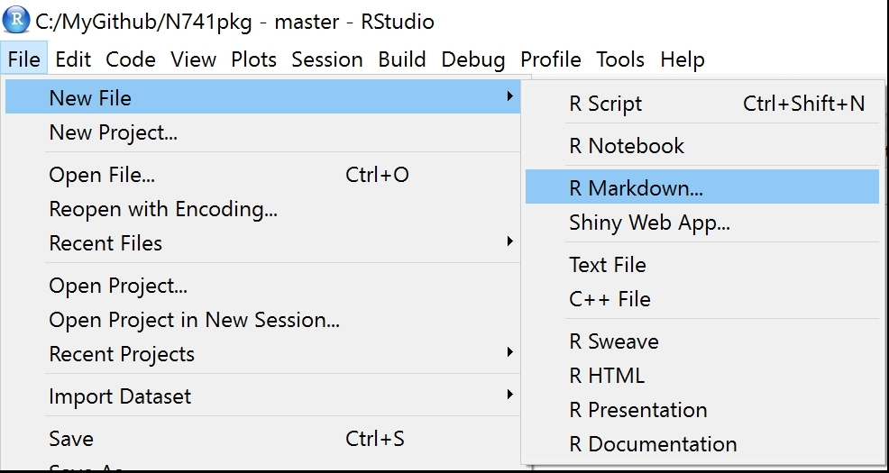
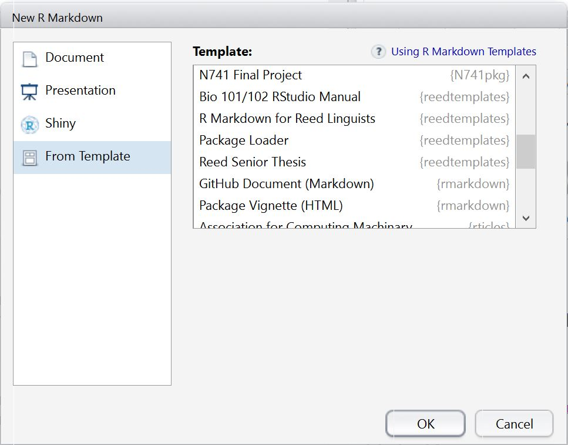

# N741pkg

Package Last Updated: 03-13-2017

## N741 Package of R code and templates for course

Install from Github

`devtools::install_github("melindahiggins2000/N741pkg")`

**NOTE 1:** You need to install the `devtools` package first to use the `devtools""install_github()` function.

**NOTE 2:** This package also needs the `dplyr` package, be sure to also have `dplyr` installed, which is part of `tidyverse`.

View [Vignette Demo](https://cdn.rawgit.com/melindahiggins2000/N741pkg/master/vignettes/vignette1.html)

## Description

This package was created for N741 Big Data Analytics for Healthcare. It contains functions and `R Markdown` templates helpful in this course.

To date, this `N741pkg` includes 2 functions and 1 `R Markdown` template described below.

## Functions Included

To date, this package includes 2 functions:

* `tbl.continuous(x,x$a,"label for var a")`
    - This function creates a table of summary statistics for a numeric variable in a data frame.
    - There are 3 arguments you need to provide:
        - a data.frame, `df`
        - a column variable from the data.frame `df$var`
        - a character vector to serve as a label for the variable `"var label"`
    - The returned table is a `data.frame` object with 1 row and 10 variables/columns. These 10 columns include:
        - `item`: the variable label provided
        - `n`: the number of non-missing values
        - `missing`: the number of missing values
        - `min`: the minimum value
        - `avg`: the average/mean value
        - `SD`: the standard deviation of the values
        - `median`: the median value
        - `Q1`: the 25th percentile (1st quartile) of the values
        - `Q3`: the 75th percentile (3rd quartile) of the values
        - `max`: the maximum value
        
* `tbl.cat(gx,gx$b)`
    - This function creates a table of summary statistics (frequencies and percents) for a categorical (or ordinal) variable in a data frame.
    - There are 2 arguments you need to provide:
        - a "grouped" data.frame, `gdf` **SEE NOTE**
        - a column variable from the "grouped" data.frame `gdf$var`
    - **NOTE** A "grouped" data.frame can be created using the `dplyr::group_by()` function. See the example provided with `help(tbl.cat)`. You need to "group_by" the categorical (or ordinal) variable you want to make the table for.
    - The returned table is a `data.frame` object with 1 row and 3 variables/columns. These 3 columns include:
        - `var`: the categorical variable categories or ordinal levels
        - `freq`: the frequencies (or counts) for each category or level
        - `pct`: the percentage of the total number of rows - these percents are NOT adjusted for missing. However, the frequency and percentage of `NA`s are provided.
        

## Template Included

To date, this package includes 1 `R Markdown` Template "N741 Final Project". After installing the `N741pkg` (from Github using `devtools::install_github()` listed above), you will be able to access the `R Markdown` template(s) included. To access these custom templates, use the File Menu to create a new `R Markdown` file:

When creating a new `R Markdown` file, in addition to "Document", "Presentation", and "shiny", you can also create a new `R Markdown` documents "From Template". Any packages you have installed which have templates included will show up here. After installing `N741pkg` you should see the "N741 Final Project" listed - just select the template and click "OK".

